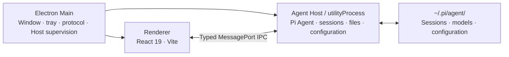

<div align="center">


# Pi Agent Desktop

**Turn Pi Coding Agent into a full desktop workspace.**

Local-first · No local server · Cross-platform

[](https://github.com/DLYZZT/pi-desktop/actions/workflows/build-desktop.yml)


**English** · [简体中文](./README.md)

[Features](#features) · [Quick start](#quick-start) · [Architecture](#architecture) · [Contributing](#contributing) · [Build and release](#build-and-release)

</div>

## Features

### A complete agent workspace

- Create, switch, rename, and delete sessions with continuously streamed responses
- Inspect tool calls, execution progress, and context compaction status
- Queue messages and use Steer or Follow-up interaction modes
- Quickly switch models, reasoning levels, tool presets, and notification sounds
- Attach images, run slash commands, and reference project files with `@`

### A project-focused file experience

- Select project directories natively and manage Git branches and worktrees
- Browse project files, open multiple tabs, download files, or reference them in prompts
- Preview Markdown, syntax-highlighted code, Mermaid, KaTeX, and Word (`.docx`) documents
- Keep sessions aligned with the project through file watching and Git status awareness

### Unified model and extension management

- Manage model providers and model configurations
- Sign in through browser-based OAuth flows
- Search for, install, and configure Skills
- Manage Plugins while continuing to use the Pi Agent extension ecosystem

### WeChat and Telegram channels

- Connect a personal WeChat account with QR-code login or a Telegram bot with a BotFather token
- Protect direct messages with pairing and Telegram groups with allowlists and mention requirements; WeChat groups are not enabled yet, and remote tools are disabled by default
- Give each external conversation an isolated Pi Session by default, or bind it from the active desktop session to share history and context with the UI
- Keep channels running in the background with long polling, reconnects, event deduplication, and cursor/offset checkpoints
- Stream Rich Message previews in Telegram private chats, preserve Markdown in the final response, and collapse reasoning and tool details; groups receive a rich final response
- Encrypt channel credentials with Electron `safeStorage`; saved tokens are never returned to the Renderer

### Designed for long-running desktop use

- Single-instance behavior, system tray, desktop notifications, and Dock/taskbar badges
- Window-state persistence, system theme integration, and custom protocol handling
- Agent Host crash recovery, crash reports, and diagnostic exports
- Electron `sandbox: true`, a strict Content Security Policy, and typed IPC contracts

## Quick start

### Use a desktop build

Pi Agent Desktop bundles the Pi Coding Agent runtime. Regular users do not need to install the Pi CLI, Pi Coding Agent, Node.js, or npm separately. Install the desktop application, configure a model provider, and start working.

The application reads sessions and configuration from `~/.pi/agent/`. If you already use the Pi CLI, your existing data is available without migration. The desktop application also works if you have never used the CLI. Installing some Skills or npm Plugins from the internet may still require Node.js and npm.

### Development requirements

- Node.js 20 or later
- npm, included with Node.js
- macOS or Windows; Linux can be used for development, but official Linux builds are not currently published

### Run locally

```bash
git clone https://github.com/DLYZZT/pi-desktop.git
cd pi-desktop
npm ci
npm run dev
```

### Download a preview build

CI currently produces the following unsigned installers:

- macOS Apple Silicon (arm64): DMG and ZIP
- macOS Intel (x64): DMG and ZIP
- Windows (x64): NSIS installer

Download artifacts from a successful [GitHub Actions build](https://github.com/DLYZZT/pi-desktop/actions/workflows/build-desktop.yml). Artifacts are retained for 14 days. Because the builds are not signed yet, the operating system may show an unknown-developer or security warning. Running from source is currently recommended.

## Architecture

Pi Agent Desktop uses a three-process Electron architecture to isolate privileged desktop capabilities, the Agent runtime, and the UI.



- **Main** manages the window lifecycle, menus, tray, notifications, custom protocols, and Agent Host supervision
- **Agent Host** runs Pi Coding Agent in an isolated `utilityProcess` and handles sessions, files, configuration, and extensions
- **Renderer** hosts the React UI and communicates only through controlled preload bridges
- **No local service** means production does not listen on TCP ports or bundle a web server

## Data, security, and privacy

- Sessions and Pi configuration remain in `~/.pi/agent/` by default
- The application does not open an additional local network port for UI communication
- The Renderer runs in the Electron sandbox with a strict Content Security Policy
- Preload exposes only controlled bridge APIs, and TypeScript contracts constrain Host RPC
- WeChat and Telegram use outbound-only long polling without a webhook or local listener
- Model providers determine how model request data is processed; review the privacy policy of every provider you configure

## Contributing

### Common commands

| Command                  | Description                                           |
| ------------------------ | ----------------------------------------------------- |
| `npm run dev`            | Start Vite, Main process build watch, and Electron    |
| `npm run typecheck`      | Run TypeScript type checking                          |
| `npm run test`           | Run the automated test suite                          |
| `npm run check:contract` | Verify coverage between API methods and Host handlers |
| `npm run smoke`          | Run Electron smoke tests                              |
| `npm run verify`         | Run the complete pre-commit quality gate              |
| `npm run build`          | Build Main, preload, and Renderer                     |
| `npm run pack`           | Generate the unpacked application directory           |
| `npm run dist`           | Build installers for the current platform             |

### Project structure

```text
src/
├── contract/      # IPC type contracts and RPC layer
├── main/          # Electron Main process
├── preload/       # Secure bridge APIs
├── agent-host/    # Agent, sessions, files, configuration, and watchers
├── renderer/      # React desktop UI
└── shared/        # Testable pure functions and shared modules
```

Use [Issues](https://github.com/DLYZZT/pi-desktop/issues) for bug reports and suggestions. Pull requests are also welcome. Before submitting code, run at least:

```bash
npm run verify
```

## Build and release

Run the complete quality gate before submitting changes or producing an installer:

```bash
npm run verify
```

Local build commands:

```bash
npm run build  # Build the application
npm run pack   # Generate an unpacked application directory
npm run dist   # Build installers for the current platform
```

GitHub Actions builds artifacts for macOS arm64, macOS x64, and Windows x64 separately. Current artifacts are unsigned. A public release still requires macOS notarization, Windows code signing, and installation testing on each target platform.

## Roadmap

- [x] Electron three-process architecture and typed IPC
- [x] Sessions, project files, models, Skills, Plugins, and OAuth
- [x] Personal WeChat and Telegram text channels
- [x] Tray, notifications, system theme, crash recovery, and diagnostic exports
- [x] macOS arm64, macOS x64, and Windows x64 CI build matrix
- [ ] macOS code signing and notarization
- [ ] Windows code signing
- [ ] End-to-end automatic update validation
- [ ] Expanded cross-platform E2E and pre-release testing

## Relationship to the Pi ecosystem

Pi Agent Desktop is a desktop workspace for Pi Coding Agent. It continues to use sessions and configuration from `~/.pi/agent/`, so it can be used alongside the CLI.

Plugins continue to load through Pi's package manager and runtime. Extension APIs that only make sense in the terminal TUI, such as custom terminal components or raw key listeners, cannot be represented equivalently in the desktop Renderer. The application reports an explicit compatibility message instead of silently ignoring them.

## License

[Apache License 2.0](./LICENSE)
