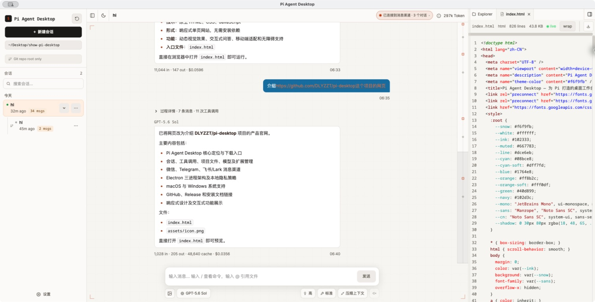
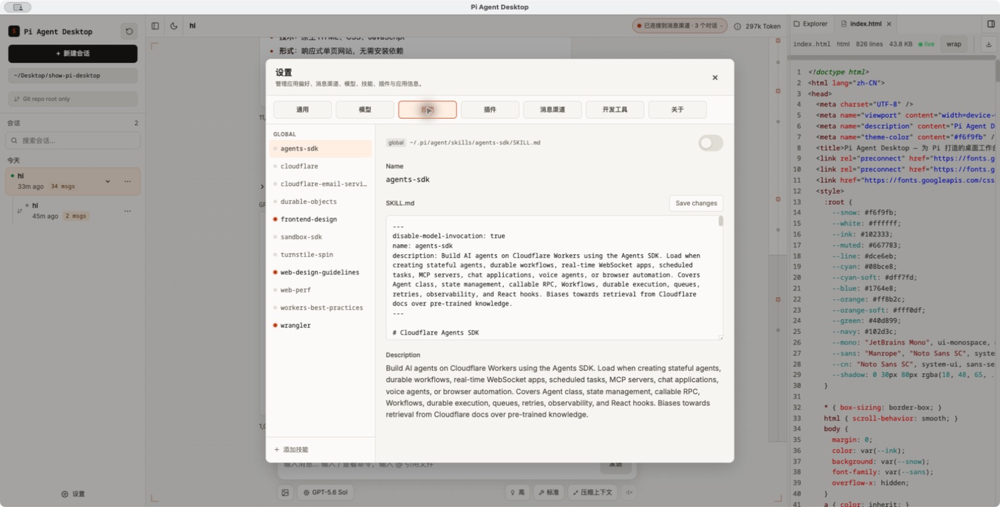
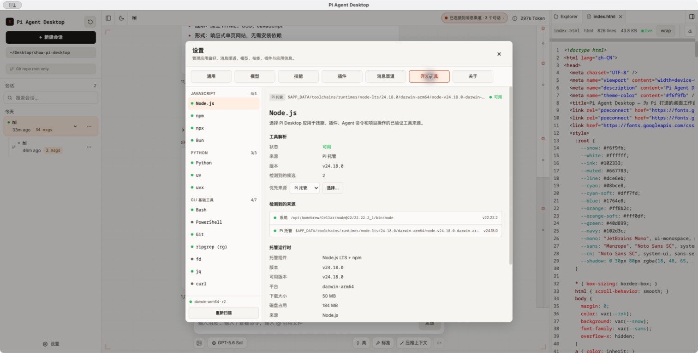
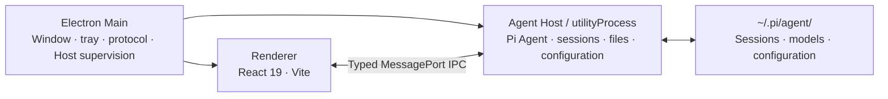

<div align="center">


# Pi Agent Desktop

**Turn Pi Coding Agent into a full desktop workspace.**

Local-first · No local server · Cross-platform

[](https://github.com/DLYZZT/pi-desktop/actions/workflows/build-desktop.yml)


**English** · [简体中文](./README.md)

[Screenshots](#screenshots) · [Features](#features) · [Quick start](#quick-start) · [Architecture](#architecture) · [Contributing](#contributing) · [Roadmap](#roadmap)

</div>

## Screenshots



<table>
  <tr>
    <td width="50%" align="center">
      
      <br />
      <sub>Browse, enable, and edit skills</sub>
    </td>
    <td width="50%" align="center">
      
      <br />
      <sub>Discover system tools and manage private runtimes</sub>
    </td>
  </tr>
</table>

## Features

### A complete agent workspace

- Create, switch, rename, and delete sessions with continuously streamed responses
- Search and browse sessions by date while using stable titles in both the sidebar and conversation header
- Inspect tool calls, execution progress, and context compaction status
- Queue messages and use Steer or Follow-up interaction modes
- Quickly switch models, reasoning levels, tool presets, and notification sounds
- Attach images, run slash commands, and reference project files with `@`
- Keep chat and composer content aligned to one reading width, with a mouse- and keyboard-resizable file panel that remembers its width

### A project-focused file experience

- Select project directories natively and manage Git branches and worktrees
- Browse project files, open multiple tabs, download files, or reference them in prompts
- Preview Markdown, syntax-highlighted code, Mermaid, KaTeX, and Word (`.docx`) documents
- Keep sessions aligned with the project through file watching and Git status awareness

### Unified model and extension management

- Manage model providers and model configurations
- Sign in through browser-based OAuth flows
- Search for, install, and configure Skills
- Manage Plugins while continuing to use the Pi Agent extension ecosystem

### WeChat, Telegram, and Feishu/Lark channels

- Connect personal WeChat with QR login, Telegram with a BotFather token, or a Feishu/Lark self-built app with an App ID and App Secret
- Protect direct messages with pairing and Telegram or Feishu/Lark groups with allowlists and mention requirements; WeChat groups are not enabled yet, and remote tools are disabled by default
- Give each external conversation an isolated Pi Session by default, or bind it from the active desktop session to share history and context with the UI; the binding list stays within the window and scrolls internally when long
- Send only the user's actual IM text as the model's user prompt; the desktop distinguishes sources with black local, green WeChat, blue Telegram, and orange Feishu/Lark user bubbles
- Receive images, files, and voice messages from WeChat, Telegram, and Feishu/Lark, plus Feishu/Lark video resources; images enter the model as multimodal input, while other attachments use an isolated staging area and WeChat SILK audio is converted to WAV when possible
- Stream previews in Telegram private chats and collapse reasoning and tool details
- Receive Feishu/Lark DMs, controlled groups, and threads through the official SDK long connection; Cards render Markdown, stream thinking and tool progress, and fold process details into the final response
- Show turn-status reactions on the source message in Telegram and Feishu/Lark; Feishu DMs can invoke `/help`, `/status`, `/new`, `/compact`, and `/reload` from a native bot menu

### Designed for long-running desktop use

- Single-instance behavior, system tray, desktop notifications, and Dock/taskbar badges
- Window-state persistence, system theme integration, and custom protocol handling
- Agent Host crash recovery, crash reports, and diagnostic exports
- Periodic or manual stable-release checks on enabled platforms, with user-approved downloads and restart installation after active tasks finish
- Electron `sandbox: true`, a strict Content Security Policy, and typed IPC contracts

## Quick start

### Use a desktop build

Pi Agent Desktop bundles the Pi Coding Agent runtime. Regular users do not need to install the Pi CLI, Pi Coding Agent, Node.js, or npm separately. Install the desktop application, configure a model provider, and start working.

The application reads sessions and configuration from `~/.pi/agent/`. If you already use the Pi CLI, your existing data is available without migration. The desktop application also works if you have never used the CLI.

Pi Desktop first discovers and verifies the user's existing Node.js/npm, Python, Git, Bash, uv, jq, and Bun installations; bundled `rg` and `fd` keep search available offline.

### Desktop system requirements

- macOS 12 Monterey or later, on Apple Silicon (arm64) or Intel (x64)
- 64-bit Windows 10 or Windows 11 on x64; Windows 11 is recommended because it remains under regular security support
- A 64-bit Linux x64 AppImage on a modern glibc distribution with a graphical desktop session; updates are currently installed manually
- Windows 32-bit (x86) and Windows ARM64 installers are not currently provided

### Development requirements

- Node.js 22.19 or later
- npm, included with Node.js
- macOS, Windows, or Linux

### Run locally

```bash
git clone https://github.com/DLYZZT/pi-desktop.git
cd pi-desktop
npm ci
npm run dev
```

### Builds

- macOS Apple Silicon (arm64): DMG and ZIP
- macOS Intel (x64): DMG and ZIP
- Windows (x64): NSIS installer
- Linux (x64): AppImage

## Architecture

Pi Agent Desktop uses a three-process Electron architecture to isolate privileged desktop capabilities, the Agent runtime, and the UI.



- **Main** manages the window lifecycle, menus, tray, notifications, software updates, custom protocols, and Agent Host supervision
- **Agent Host** runs Pi Coding Agent in an isolated `utilityProcess` and handles sessions, files, configuration, and extensions
- **Renderer** hosts the React UI and communicates only through controlled preload bridges
- **No local service** means production does not listen on TCP ports or bundle a web server

## Data, security, and privacy

- Sessions and Pi configuration remain in `~/.pi/agent/` by default
- The application does not open an additional local network port for UI communication
- The Renderer runs in the Electron sandbox with a strict Content Security Policy
- Preload exposes only controlled bridge APIs, and TypeScript contracts constrain Host RPC
- The update client uses only the public GitHub Release configuration embedded in production builds; it accepts neither update URLs nor release credentials from the Renderer
- WeChat and Telegram use outbound-only long polling, while Feishu/Lark uses an outbound WebSocket; none opens a webhook or local listener
- Model providers determine how model request data is processed; review the privacy policy of every provider you configure

## Contributing

### Common commands

| Command                      | Description                                                          |
| ---------------------------- | -------------------------------------------------------------------- |
| `npm run dev`                | Start Vite, Main process build watch, and Electron                   |
| `npm run typecheck`          | Run TypeScript type checking                                         |
| `npm run test`               | Run the automated test suite                                         |
| `npm run check:contract`     | Verify coverage between API methods and Host handlers                |
| `npm run smoke`              | Run Electron smoke tests                                             |
| `npm run verify`             | Run the complete pre-commit quality gate                             |
| `npm run build`              | Build Main, preload, and Renderer                                    |
| `npm run pack`               | Generate the unpacked application directory                          |
| `npm run dist`               | Build every configured architecture for this platform                |
| `npm run dist:mac:signed`    | Build a Developer ID-signed package for the current Mac architecture |
| `npm run dist:mac:notarized` | Build a signed and Apple-notarized macOS package                     |

### Project structure

```text
src/
├── contract/      # IPC type contracts and RPC layer
├── main/          # Electron Main process
├── preload/       # Secure bridge APIs
├── agent-host/    # Agent, sessions, files, configuration, and watchers
├── renderer/      # React desktop UI
└── shared/        # Testable pure functions and shared modules
```

Use [Issues](https://github.com/DLYZZT/pi-desktop/issues) for bug reports and suggestions. Pull requests are also welcome. Before submitting code, run at least:

```bash
npm run verify
```

## Roadmap

- [x] Electron three-process architecture and typed IPC
- [x] Sessions, project files, models, Skills, Plugins, and OAuth
- [x] Personal WeChat, Telegram, and Feishu/Lark text, image, file, and voice channels, plus Feishu/Lark video resources
- [x] Tray, notifications, system theme, crash recovery, and diagnostic exports
- [x] Linux, macOS, and Windows CI tests plus the production release build matrix
- [x] Local macOS signing/notarization tooling and the `v*` tag release workflow
- [x] First end-to-end `v*` tag signing, notarization, and production Release validation
- [x] Production Windows x64 Release asset pipeline (currently without code signing)
- [x] Validate the first Release containing both macOS and Windows production assets (v0.1.1)
- [x] Implement Main-process stable-release checks, user-approved downloads, restart installation, and update settings
- [x] Validate updater-enabled baseline-to-target upgrades end to end on macOS and Windows
- [ ] Expanded cross-platform E2E and pre-release testing

## Relationship to the Pi ecosystem

Pi Agent Desktop is a desktop workspace for Pi Coding Agent. It continues to use sessions and configuration from `~/.pi/agent/`, so it can be used alongside the CLI.

Plugins continue to load through Pi's package manager and runtime. Extension APIs that only make sense in the terminal TUI, such as custom terminal components or raw key listeners, cannot be represented equivalently in the desktop Renderer. The application reports an explicit compatibility message instead of silently ignoring them.

## License

[Apache License 2.0](./LICENSE)
