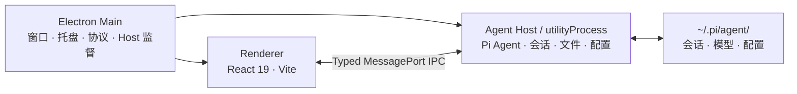

<div align="center">


# Pi Agent Desktop

**把 Pi Coding Agent 变成真正的桌面工作台。**

本地优先 · 零本地服务器 · 跨平台应用

[](https://github.com/DLYZZT/pi-desktop/actions/workflows/build-desktop.yml)


[English](./README.en.md) · **简体中文**

[截图](#应用截图) · [功能](#核心能力) · [快速开始](#快速开始) · [架构](#架构设计) · [参与开发](#参与开发) · [路线图](#路线图)

</div>

## 应用截图


<table>
  <tr>
    <td width="50%" align="center">
      
      <br />
      <sub>技能浏览、启用与内容编辑</sub>
    </td>
    <td width="50%" align="center">
      
      <br />
      <sub>系统工具发现与托管运行时管理</sub>
    </td>
  </tr>
</table>

## 核心能力

### 一个完整的 Agent 工作台

- 创建、切换、重命名和删除会话，并持续展示流式回复
- 搜索会话、按日期分组浏览，并在列表和主对话顶部使用稳定的会话标题
- 查看工具调用、执行过程和上下文压缩状态
- 支持排队消息、Steer / Follow-up 等交互方式
- 快速切换模型、推理等级、工具预设和提示音
- 支持图片附件、斜杠命令与 `@` 文件引用
- 对话与输入框使用一致的阅读宽度，右侧文件面板可通过鼠标或键盘调整并记住宽度

### 围绕项目工作的文件体验

- 原生选择项目目录，管理 Git 分支与 Worktree
- 浏览项目文件、打开多标签页、下载或引用文件
- Markdown、代码高亮、Mermaid、KaTeX 与 Word（`.docx`）文档预览
- 文件变更监听与 Git 状态感知，让会话始终贴近当前项目

### 模型与扩展统一管理

- 管理模型提供商和模型配置
- 支持浏览器 OAuth 登录流程
- 搜索、安装和配置 Skills
- 管理 Plugins，并沿用 Pi Agent 的扩展体系

### 微信、Telegram 与飞书/Lark 消息渠道

- 个人微信二维码登录、Telegram BotFather token，以及飞书/Lark 企业自建应用 App ID/App Secret 接入
- 私聊配对，以及 Telegram、飞书/Lark 群聊白名单与 @触发控制；微信群尚未开放，默认不授予远程工具权限
- 外部对话默认使用独立 Pi Session，也可从当前会话顶部快速绑定并与 UI 共用上下文；绑定列表会在窗口内自动定位，长列表支持内部滚动
- 模型用户正文只包含 IM 实际文本；桌面端用本地黑、微信绿、Telegram 蓝、飞书/Lark 橙的用户气泡区分来源
- 微信、Telegram 与飞书/Lark 支持入站图片、文件和语音；飞书/Lark 还支持视频资源，图片直接作为多模态输入，其他附件进入隔离暂存区，微信 SILK 语音优先转为 WAV
- Telegram 私聊支持流式预览，并折叠思考与工具详情
- 飞书/Lark 通过官方 SDK 长连接收取私聊、受控群聊和 thread，并使用 Card 渲染 Markdown、流式显示思考/工具调用、最终折叠过程
- Telegram 与飞书/Lark 在原消息上显示回合 Reaction 状态；飞书单聊可用原生菜单触发 `/help`、`/status`、`/new`、`/compact` 和 `/reload`

### 为长期运行而设计

- 单实例、系统托盘、桌面通知与 Dock / 任务栏角标
- 窗口状态记忆、系统主题跟随和自定义协议
- Agent Host 异常恢复、崩溃报告与诊断信息导出
- 已启用平台的正式安装版可定时或手工检查稳定版更新，由用户确认下载，并在任务结束后重启安装
- `sandbox: true`、严格 CSP 与类型化 IPC 契约

## 快速开始

### 使用桌面安装包

Pi Agent Desktop 已内置 Pi Coding Agent 运行时。普通用户无需单独安装 Pi CLI、Pi Coding Agent、Node.js 或 npm；安装桌面应用并配置模型提供商后即可使用。

应用会读取 `~/.pi/agent/` 中的会话与配置。如果你已经使用 Pi CLI，可以直接复用现有数据，无需迁移；此前没有使用过 Pi CLI 也不影响使用。

Pi Desktop 会先发现并验证用户已经安装的 Node.js/npm、Python、Git、Bash、uv、jq 和 Bun；内置的 `rg`/`fd` 保证离线搜索可用。

### 桌面安装包系统要求

- macOS 12 Monterey 或更高版本，支持 Apple Silicon（arm64）和 Intel（x64）
- Windows 10 或 Windows 11 64 位（x64）；推荐使用仍在常规安全支持期内的 Windows 11
- Linux 64 位（x64）AppImage，需要现代 glibc 发行版和可用的桌面图形会话；当前采用手工下载安装更新
- 暂不提供 Windows 32 位（x86）或 Windows ARM64 安装包

### 源码开发环境要求

- Node.js 22.19 或更高版本
- npm（随 Node.js 安装即可）
- macOS、Windows 或 Linux

### 本地运行

```bash
git clone https://github.com/DLYZZT/pi-desktop.git
cd pi-desktop
npm ci
npm run dev
```

### 构建

- macOS Apple Silicon（arm64）：DMG + ZIP
- macOS Intel（x64）：DMG + ZIP
- Windows（x64）：NSIS 安装程序
- Linux（x64）：AppImage

## 架构设计

Pi Agent Desktop 使用 Electron 三进程模型，将高权限桌面能力、Agent 运行时和 UI 隔离开来。



- **Main**：负责窗口生命周期、菜单、托盘、通知、软件更新、自定义协议和 Agent Host 监督
- **Agent Host**：在独立 `utilityProcess` 中运行 Pi Coding Agent，处理会话、文件、配置与扩展
- **Renderer**：运行 React UI，只通过受控的 preload bridge 与 Host 交互
- **无本地服务**：生产环境不监听 TCP 端口，也不需要附带 Web Server

## 数据、安全与隐私

- 会话与 Pi 配置默认留在本机 `~/.pi/agent/`
- 应用不会为了 UI 通信额外开放本地网络端口
- Renderer 开启 Electron sandbox，并使用严格的 Content Security Policy
- preload 只暴露受控桥接接口，Host RPC 由 TypeScript 契约约束
- 更新客户端只使用正式包内固定的公开 GitHub Release 配置，不接收 Renderer 提供的更新地址或发布凭证
- 微信和 Telegram 只发起出站 long polling，飞书/Lark 使用出站 WebSocket；均不开放 webhook 或本地监听端口
- 模型请求的数据处理方式取决于你配置的模型提供商，请同时查看对应服务的隐私政策

## 参与开发

### 常用命令

| 命令                         | 说明                                    |
| ---------------------------- | --------------------------------------- |
| `npm run dev`                | 启动 Vite、主进程构建监听与 Electron    |
| `npm run typecheck`          | 执行 TypeScript 类型检查                |
| `npm run test`               | 运行自动化测试套件                      |
| `npm run check:contract`     | 检查 API 方法与 Host handler 覆盖关系   |
| `npm run smoke`              | 运行 Electron 冒烟测试                  |
| `npm run verify`             | 执行提交前的完整质量检查                |
| `npm run build`              | 构建 main、preload 与 renderer          |
| `npm run pack`               | 生成未封装的应用目录                    |
| `npm run dist`               | 生成当前平台配置的全部架构安装包        |
| `npm run dist:mac:signed`    | 生成当前 Mac 架构的 Developer ID 签名包 |
| `npm run dist:mac:notarized` | 生成签名并经 Apple 公证的 macOS 包      |

### 项目结构

```text
src/
├── contract/      # IPC 类型契约与 RPC 层
├── main/          # Electron 主进程
├── preload/       # 安全桥接接口
├── agent-host/    # Agent、会话、文件、配置与 watcher
├── renderer/      # React 桌面界面
└── shared/        # 可测试的纯函数与共享模块
```

欢迎通过 [Issues](https://github.com/DLYZZT/pi-desktop/issues) 提交问题或建议，也欢迎直接发起 Pull Request。提交代码前请至少运行：

```bash
npm run verify
```

## 路线图

- [x] Electron 三进程架构与类型化 IPC
- [x] 会话、项目文件、模型、Skills、Plugins 与 OAuth
- [x] 个人微信、Telegram 与飞书/Lark 文本、图片、文件和语音消息渠道，以及飞书/Lark 视频资源
- [x] 托盘、通知、系统主题、崩溃恢复与诊断导出
- [x] Linux、macOS、Windows CI 测试与正式发布构建矩阵
- [x] macOS 本地签名/公证工具与 `v*` tag release workflow
- [x] 首次 `v*` tag 双架构签名、公证与正式 Release 端到端验收
- [x] Windows x64 正式 Release 资产管线（当前不配置代码签名）
- [x] 首个同时包含 macOS 与 Windows 正式资产的 Release 验收（v0.1.1）
- [x] 实现主进程稳定版检查、用户确认下载、重启安装和设置界面
- [x] 完成 updater-enabled 基线到更高版本的 macOS 与 Windows 端到端升级验证
- [ ] 扩充跨平台 E2E 测试与发布前检查

## 与 Pi 生态的关系

Pi Agent Desktop 是 Pi Coding Agent 的桌面工作台，继续使用 `~/.pi/agent/` 中的会话和配置，因此可以与 CLI 配合使用。

Plugins 继续通过 Pi 的包管理器与运行时加载。仅适用于终端 TUI 的扩展接口（例如自定义终端组件或原始按键监听）无法在桌面 Renderer 中等价呈现；应用会显示明确的兼容性提示，不会静默忽略。

## License

[Apache License 2.0](./LICENSE)
