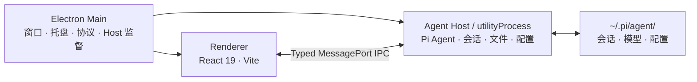

<div align="center">


# Pi Agent Desktop

**把 Pi Coding Agent 变成真正的桌面工作台。**

本地优先 · 零本地服务器 · 跨平台应用

[](https://github.com/DLYZZT/pi-desktop/actions/workflows/build-desktop.yml)


[功能](#核心能力) · [快速开始](#快速开始) · [架构](#架构设计) · [参与开发](#参与开发) · [发布](#构建与发布)

</div>

## 核心能力

### 一个完整的 Agent 工作台

- 创建、切换、重命名和删除会话，并持续展示流式回复
- 查看工具调用、执行过程和上下文压缩状态
- 支持排队消息、Steer / Follow-up 等交互方式
- 快速切换模型、推理等级、工具预设和提示音
- 支持图片附件、斜杠命令与 `@` 文件引用

### 围绕项目工作的文件体验

- 原生选择项目目录，管理 Git 分支与 Worktree
- 浏览项目文件、打开多标签页、下载或引用文件
- Markdown、代码高亮、Mermaid、KaTeX 与 Word（`.docx`）文档预览
- 文件变更监听与 Git 状态感知，让会话始终贴近当前项目

### 模型与扩展统一管理

- 管理模型提供商和模型配置
- 支持浏览器 OAuth 登录流程
- 搜索、安装和配置 Skills
- 管理 Plugins，并沿用 Pi Agent 的扩展体系

### 为长期运行而设计

- 单实例、系统托盘、桌面通知与 Dock / 任务栏角标
- 窗口状态记忆、系统主题跟随和自定义协议
- Agent Host 异常恢复、崩溃报告与诊断信息导出
- `sandbox: true`、严格 CSP 与类型化 IPC 契约

## 快速开始

### 使用桌面安装包

Pi Agent Desktop 已内置 Pi Coding Agent 运行时。普通用户无需单独安装 Pi CLI、Pi Coding Agent、Node.js 或 npm；安装桌面应用并配置模型提供商后即可使用。

应用会读取 `~/.pi/agent/` 中的会话与配置。如果你已经使用 Pi CLI，可以直接复用现有数据，无需迁移；此前没有使用过 Pi CLI 也不影响使用。在线安装部分 Skills 或 npm Plugins 时，系统可能需要提供 Node.js 和 npm。

### 源码开发环境要求

- Node.js 20 或更高版本
- npm（随 Node.js 安装即可）
- macOS 或 Windows；Linux 可用于开发，但暂未提供正式构建产物

### 本地运行

```bash
git clone https://github.com/DLYZZT/pi-desktop.git
cd pi-desktop
npm ci
npm run dev
```

### 获取预览构建

CI 当前生成以下未签名安装包：

- macOS Apple Silicon（arm64）：DMG + ZIP
- macOS Intel（x64）：DMG + ZIP
- Windows（x64）：NSIS 安装程序

可以在 [GitHub Actions](https://github.com/DLYZZT/pi-desktop/actions/workflows/build-desktop.yml) 的成功构建中下载 Artifacts，产物保留 14 天。由于尚未签名，系统可能显示未知开发者或安全警告；现阶段更推荐从源码运行。

## 架构设计

Pi Agent Desktop 使用 Electron 三进程模型，将高权限桌面能力、Agent 运行时和 UI 隔离开来。



- **Main**：负责窗口生命周期、菜单、托盘、通知、自定义协议和 Agent Host 监督
- **Agent Host**：在独立 `utilityProcess` 中运行 Pi Coding Agent，处理会话、文件、配置与扩展
- **Renderer**：运行 React UI，只通过受控的 preload bridge 与 Host 交互
- **无本地服务**：生产环境不监听 TCP 端口，也不需要附带 Web Server

## 数据、安全与隐私

- 会话与 Pi 配置默认留在本机 `~/.pi/agent/`
- 应用不会为了 UI 通信额外开放本地网络端口
- Renderer 开启 Electron sandbox，并使用严格的 Content Security Policy
- preload 只暴露受控桥接接口，Host RPC 由 TypeScript 契约约束
- 模型请求的数据处理方式取决于你配置的模型提供商，请同时查看对应服务的隐私政策

## 参与开发

### 常用命令

| 命令                     | 说明                                  |
| ------------------------ | ------------------------------------- |
| `npm run dev`            | 启动 Vite、主进程构建监听与 Electron  |
| `npm run typecheck`      | 执行 TypeScript 类型检查              |
| `npm run test`           | 运行 shared 纯函数测试                |
| `npm run check:contract` | 检查 API 方法与 Host handler 覆盖关系 |
| `npm run smoke`          | 运行 Electron 冒烟测试                |
| `npm run verify`         | 执行提交前的完整质量检查              |
| `npm run build`          | 构建 main、preload 与 renderer        |
| `npm run pack`           | 生成未封装的应用目录                  |
| `npm run dist`           | 生成当前平台安装包                    |

### 项目结构

```text
src/
├── contract/      # IPC 类型契约与 RPC 层
├── main/          # Electron 主进程
├── preload/       # 安全桥接接口
├── agent-host/    # Agent、会话、文件、配置与 watcher
├── renderer/      # React 桌面界面
└── shared/        # 可测试的纯函数与共享模块
```

欢迎通过 [Issues](https://github.com/DLYZZT/pi-desktop/issues) 提交问题或建议，也欢迎直接发起 Pull Request。提交代码前请至少运行：

```bash
npm run verify
```

## 路线图

- [x] Electron 三进程架构与类型化 IPC
- [x] 会话、项目文件、模型、Skills、Plugins 与 OAuth
- [x] 托盘、通知、系统主题、崩溃恢复与诊断导出
- [x] macOS arm64、macOS x64、Windows x64 CI 构建矩阵
- [ ] macOS 签名与 notarization
- [ ] Windows 代码签名
- [ ] 自动更新端到端验证
- [ ] 扩充跨平台 E2E 测试与发布前检查

## 与 Pi 生态的关系

Pi Agent Desktop 是 Pi Coding Agent 的桌面工作台，继续使用 `~/.pi/agent/` 中的会话和配置，因此可以与 CLI 配合使用。

Plugins 继续通过 Pi 的包管理器与运行时加载。仅适用于终端 TUI 的扩展接口（例如自定义终端组件或原始按键监听）无法在桌面 Renderer 中等价呈现；应用会显示明确的兼容性提示，不会静默忽略。

## License

[Apache License 2.0](./LICENSE)
