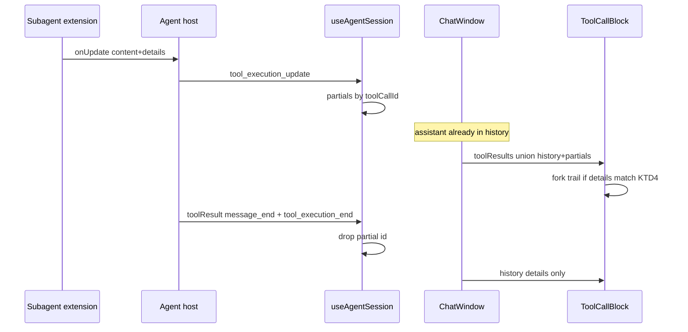
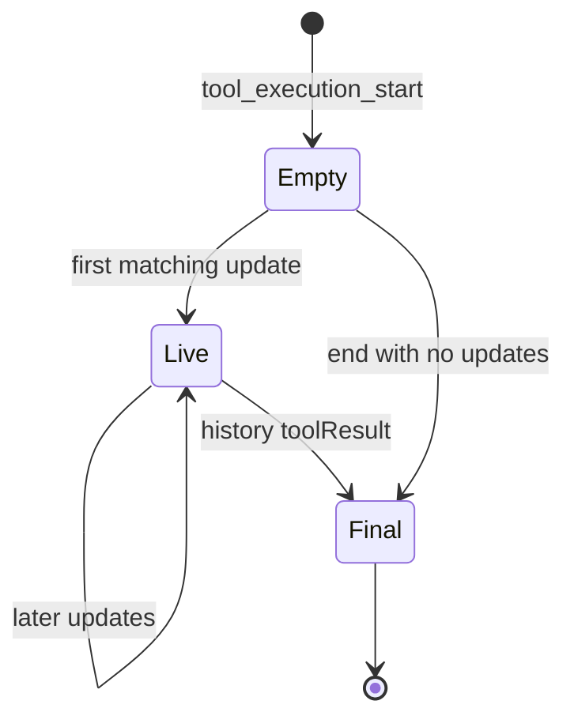
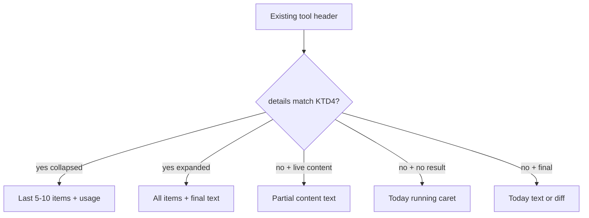

# Subagent Tool Card Status - Plan

## Goal Capsule

- **Objective:** Desktop tool card shows live and completed subagent progress in the TUI collapsed shape, without changing the subagent extension or spawning child sessions.
- **Authority:** This plan's Product Contract, then `.scratch/fork-overlay/DECISIONS.md` overlay rule, then existing renderer event/tool-card patterns.
- **Execution profile:** Three units. Pure trail model first, then event apply, then overlay hook + merge. Contract tests only.
- **Stop:** Host does not actually emit `tool_execution_update` to the renderer, or completed `toolResult` drops `details`. Report and stop. Do not invent a new protocol.
- **Tail:** Implementation owns local tests. No PR/release in this plan.

## Product Contract

### Summary

Desktop already receives subagent `onUpdate` payloads and stores `details` on the final tool result.
The renderer ignores updates and paints `running` until end, then only the final text.
This plan makes the parent tool card consume those payloads: live collapsed trail while running, same trail after complete, expand for the full path.

### Problem Frame

A subagent is a separate `pi --mode json --no-session` process.
The parent card is a black box for minutes.
CLI TUI already renders live tool calls and usage from the same `details`.
Telegram/Feishu adapters already map `tool_execution_update`.
Desktop host forwards the event; `useAgentSession` has no case for it.
`ToolCallBlock` treats missing `toolResult` as `running`.
After complete, `details` sits unused except for edit diffs.

### Requirements

**Live card**

- R1. While a subagent tool is running, the parent tool card shows a live collapsed trail instead of a bare `running` caret.
- R2. The collapsed trail shows agent identity, live/done/fail mark, the last 5–10 child tool or text items, and usage when present.

**After complete**

- R3. After the tool ends, the same collapsed trail remains on the card.
- R4. Expanding the card shows the full child item list and final output, not only the last 5–10 items.

**Other tools**

- R5. A non-subagent tool that emits `onUpdate` may show live `content` text.
- R6. A non-subagent tool without a subagent-shaped `details` object keeps today's card (header + `running` or final text / diff).

**Constraints**

- R7. The subagent extension is not modified.
- R8. Child pi processes do not appear as sidebar sessions.
- R9. Proof is renderer contract tests with fixture events and `details` shapes, not a live child-pi e2e.

### Key Decisions

- Tool card is the live surface. `(session-settled: user-directed — chosen over status-bar widget and sidebar child session: watcher stays on the parent call)` Governs R1, R7, R8.
- Live density is TUI collapsed equivalent. `(session-settled: user-directed — chosen over minimal HUD and full nested transcript: same mental model as CLI, enough to see the current tool)` Governs R2, R4.
- Completed cards keep the trail. `(session-settled: user-directed — chosen over live-only then collapse to final answer: post-hoc review of what scout/worker did)` Governs R3, R4.
- Verification stays on fixture contract tests. `(session-settled: user-directed — chosen over live child-pi e2e: cheaper and enough for this renderer gap)` Governs R9.

### Actors

- A1. Desktop user watching the parent session.

### Key Flows

- F1. Single subagent run
  - **Trigger:** Parent model calls `subagent` with one agent.
  - **Actors:** A1
  - **Steps:** Assistant message commits with the tool call. Updates fill the card trail. Tool end freezes the same trail from stored `details`.
  - **Covered by:** R1, R2, R3
- F2. Parallel or chain
  - **Trigger:** Parent calls `subagent` with `tasks` or `chain`.
  - **Actors:** A1
  - **Steps:** Card lists each child row. Parallel header can read `N/M done`. Expand shows every child's items.
  - **Covered by:** R2, R4
- F3. Reload a finished session
  - **Trigger:** User opens a session that already has a subagent `toolResult` with `details`.
  - **Actors:** A1
  - **Steps:** Card renders the trail from stored `details`. No live map involved.
  - **Covered by:** R3, R4
- F4. Ordinary tool
  - **Trigger:** `bash` / `read` / edit tool runs.
  - **Actors:** A1
  - **Steps:** Card stays today's UI unless that tool also sent a subagent-shaped `details`.
  - **Covered by:** R5, R6

### Acceptance Examples

- AE1. Covers F1 / R1 / R2. Given a live `tool_execution_update` whose `details.mode` is `single` and `results[0]` has a `grep` tool call. When the parent card renders. Then the user sees the agent name, a live mark, and `grep` in the last items, not only `running`.
- AE2. Covers F3 / R3 / R4. Given a history `toolResult` with subagent `details` and more than 10 child items. When the card is collapsed. Then only the last 5–10 items show. When expanded. Then all items and the final text show.
- AE3. Covers F4 / R6. Given a running `bash` tool with no `details`. When the card renders. Then it still shows today's `running` caret.

### Success Criteria

- A1 can tell which child agent is running and which child tool last ran without leaving the parent card.
- After reload, a completed subagent card still shows that path.
- Ordinary tool cards do not change layout.

### Scope Boundaries

- In: Desktop renderer consumption of existing update + `details`.
- Out: subagent extension edits, sidebar child sessions, status-bar widget as the primary surface, default full transcript, new host RPC, persist mid-run partials to jsonl.

#### Deferred to Follow-Up Work

- Dual-surface status-bar echo of the same trail.
- Host-side fix if `tool_execution_update` is found not to reach the renderer (stop condition, not this plan's scope to invent).

### Sources

- Session grill that closed the Product Key Decisions.
- Subagent `onUpdate` / `details` / TUI `renderResult` in the installed extension (live parallel uses `exitCode === -1`).
- Host generic event emit in `src/agent-host/rpc-manager.ts`.
- Channel `tool_execution_update` mapping in `src/agent-host/channels/pi-session-bridge.ts`.
- Renderer ignore path: `src/renderer/hooks/useAgentSession.ts` (`tool_execution_start` / `end` only).
- Card: `src/renderer/components/MessageView.tsx` `ToolCallBlock`.
- Result index: `src/renderer/lib/tool-message-index.ts`.
- Streaming bubble does not receive `toolResults`; live tools sit on the committed assistant message after `message_end`.
- Overlay law: `.scratch/fork-overlay/DECISIONS.md`.

---

## Planning Contract

Product Contract preservation: ce-plan-bootstrap, no upstream contract to preserve.

### Key Technical Decisions

- KTD1. **Overlay hook, not a MessageView rewrite.** Extra UI lives under `src/renderer/fork/`. Upstream `ToolCallBlock` / `ChatWindow` / `useAgentSession` only call thin hooks. Follows fork overlay law. Instantiates the tool-card Key Decision for R1.
- KTD2. **Live vs final is store identity, not `exitCode`.** A result from the in-memory partial map is live. A history `toolResult` is final. Single-mode live payloads start at `exitCode: 0`, so `exitCode` cannot mark ⏳. Parallel already uses `-1` for running rows; the view-model may honor that inside a live payload. Instantiates R1, R2.
- KTD3. **Merge partials as synthetic `toolResult`s.** `ChatWindow` unions the partial map into `toolResults` for the committed assistant message. `ToolCallBlock` then always has a `result` during live subagent work and does not need a third running state. Instantiates R1, R5.
- KTD4. **Recognize subagent `details` by shape.** Require `mode` in `single | parallel | chain` and a `results` array. Do not key only on `toolName === "subagent"`. Missing or foreign `details` falls through to R5/R6. Instantiates R2, R6.
- KTD5. **Partials are ephemeral.** Do not write `tool_execution_update` into session jsonl. Final trail comes from the real `toolResult.details` after `tool_execution_end`. Instantiates R3, R7.

### High-Level Technical Design

### Assumptions

- Host `inner.subscribe` already forwards `tool_execution_update` to the renderer event stream.
- Completed `toolResult` messages already persist `details` when the extension returns them.
- U1/U2 fixture tests fail closed if either assumption is wrong; implementer stops per Goal Capsule.

### Implementation Constraints

- No new dependencies.
- No feature flag, compat wrapper, or details-schema versioning.
- New chrome strings go through existing `useI18n` if they are user-facing sentences. Icons and raw agent/tool names stay as data.
- Overlay rebase surface stays hook-sized.

### Sequencing

U1 view-model → U2 event apply → U3 merge + hook.
U3 needs both. Do not hook MessageView before the model can render a fixture.

---

## Implementation Units

### U1. Subagent trail view-model

**Goal:** Pure function turns unknown `details` plus live/final flag into collapsed and expanded trail rows.
**Requirements:** R2, R4, R6
**Dependencies:** none
**Files:**

- `src/renderer/fork/subagent-trail.ts`
- `src/renderer/fork/subagent-trail.test.mjs`
  **Approach:**

1. Duck-type per KTD4. Return null for foreign details.
2. Build per-result rows: agent, live/done/fail mark per KTD2, last 5–10 display items collapsed, all items expanded, usage string.
3. Parallel/chain: one header line plus one row per child. Honor `exitCode === -1` as running inside a live payload.
   **Patterns to follow:** `src/renderer/fork/usage.ts` (pure fork helper + sibling test). Item formatting can mirror the extension's `getDisplayItems` / `formatToolCall` idea without importing the extension.
   **Execution note:** Test-first on fixtures: single live grep, parallel mixed -1/0, chain, foreign details, >10 items collapse.
   **Test scenarios:**

- Covers AE1. Single live details with one child `grep` → not null, live mark, `grep` in collapsed items.
- Covers AE2. Final details with 12 text/tool items → collapsed length 10, expanded length 12, final text present when expanded.
- Foreign `{ patch: "..." }` details → null.
- Parallel live: one `exitCode === -1`, one `0` → header shows 1/2 done and the running row is live.
- Empty `results` → still recognized if mode is valid; collapsed shows no items, not today's `running` decision (U3 owns that fallback).
  **Verification:** `node scripts/test.mjs src/renderer/fork/subagent-trail.test.mjs`

### U2. Apply tool_execution_update

**Goal:** Renderer keeps an ephemeral partial result per `toolCallId` and drops it on end.
**Requirements:** R1, R5, R9
**Dependencies:** none
**Files:**

- `src/renderer/lib/tool-execution-partials.ts`
- `src/renderer/lib/tool-execution-partials.test.mjs`
- `src/renderer/hooks/useAgentSession.ts`
  **Approach:**

1. Pure apply/remove helpers for a `Map<toolCallId, ToolResultMessage>`.
2. `tool_execution_update` upserts `{ role: "toolResult", toolCallId, toolName, content, details }` from `partialResult`.
3. `tool_execution_end` and run reset delete that id.
4. Return the partial map from `useAgentSession` so `ChatWindow` can merge it. Do not keep the map hook-local.
5. Confirm the event type string the renderer actually receives before wiring. If it never arrives, stop.
   **Patterns to follow:** Existing `handleAgentEvent` cases for `tool_execution_start` / `end`. Channel mapping in `src/agent-host/channels/pi-session-bridge.ts` for field names (`partialResult`).
   **Execution note:** Characterize the apply helper first. Hook is a thin case.
   **Test scenarios:**

- Update then second update same id → map size 1, latest content/details win.
- Update then end → map empty.
- Update missing `toolCallId` → map unchanged.
- `partialResult` with only `content` text (no details) → synthetic result still stored (R5).
- Run reset / `agent_end` → map empty.
  **Verification:** `node scripts/test.mjs src/renderer/lib/tool-execution-partials.test.mjs`

### U3. Card hook and history merge

**Goal:** Committed assistant tool cards render U1 trails from history or partials. Ordinary cards unchanged.
**Requirements:** R1, R3, R4, R5, R6
**Dependencies:** U1, U2
**Files:**

- `src/renderer/fork/SubagentTrail.tsx`
- `src/renderer/fork/index.ts`
- `src/renderer/components/MessageView.tsx`
- `src/renderer/components/ChatWindow.tsx`
- `src/renderer/components/message-view.test.mjs`
  **Approach:**

1. `ChatWindow` merges U2 partials into `toolResults` for history `MessageView`s. Streaming bubble stays as today (it has no tool results).
2. `ToolCallBlock` calls a fork hook: if U1 returns a trail, render it in the result body; else keep today's `running` / text / diff.
3. Expand uses the existing header toggle. Collapsed vs expanded is the existing `expanded` boolean.
4. Keep hook call sites one-liners per KTD1.
   **Patterns to follow:** `forkStatusBarStatuses` / `forkNoticeDurationMs` call sites. `message-view.test.mjs` `renderToStaticMarkup` + `importTestBundle`.
   **Test scenarios:**

- Covers AE1. Assistant + toolCall + synthetic live result with single-mode details → markup has agent name and child tool, not a lone `running`.
- Covers AE2. Final `toolResult` with 12 items → collapsed omits early item text; expanded includes it.
- Covers AE3. Running `bash` with no result → still contains `running`.
- Edit tool with `details.patch` and no subagent shape → still a diff, not a trail.
- History-only final subagent `details` (no partial map) → trail renders. Proves F3.
  **Verification:** `node scripts/test.mjs src/renderer/components/message-view.test.mjs src/renderer/fork/subagent-trail.test.mjs`

---

## Verification Contract

| Gate                         | Command                                                                   | Proves               |
| ---------------------------- | ------------------------------------------------------------------------- | -------------------- |
| U1                           | `node scripts/test.mjs src/renderer/fork/subagent-trail.test.mjs`         | R2, R4, R6 duck-type |
| U2                           | `node scripts/test.mjs src/renderer/lib/tool-execution-partials.test.mjs` | R1, R5 apply/reset   |
| U3                           | `node scripts/test.mjs src/renderer/components/message-view.test.mjs`     | AE1–AE3, F3          |
| Types if public types change | `npm run typecheck`                                                       | hook signatures      |

No `release:validate`. No browser/electron e2e. No live child pi.

Before any extra check: name the live uncertainty it would settle. If the unit test already settled it, do not add another gate.

---

## Definition of Done

- R1–R9 have a unit that cites them and a test scenario that can fail.
- Overlay extras are in `src/renderer/fork/`. Upstream diffs are hook lines plus merge plumbing.
- Subagent extension files are untouched.
- Abandoned spikes deleted.
- Stop condition honored if events or `details` persistence are missing.

### Per-unit done

- U1. Foreign details return null. Collapse/expand counts match AE2.
- U2. Latest update wins. End/reset clears.
- U3. AE1–AE3 markup tests pass. Bash card still shows `running`.
